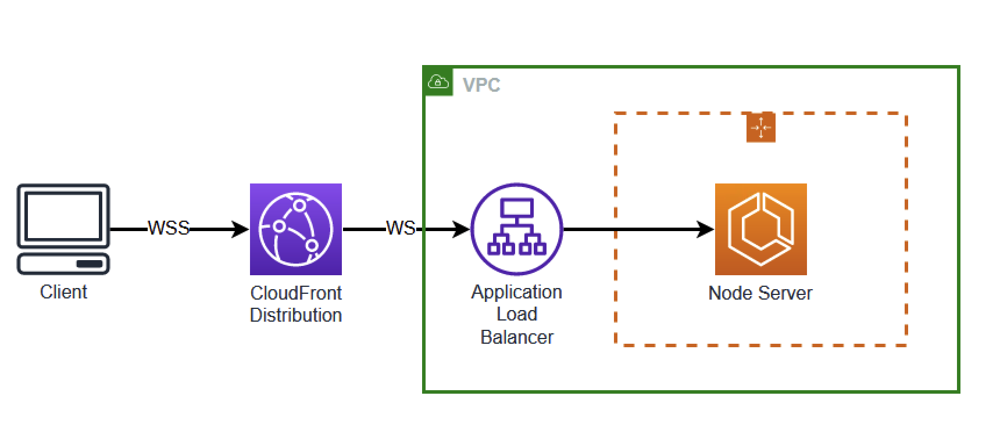

# CDK Websocket Server

In this demo, we see how to build a simple WebSocket server using Amazon Elastic Container Service with Fargate. This demo also includes an [Amazon CloudFront Distribution](https://docs.aws.amazon.com/AmazonCloudFront/latest/DeveloperGuide/distribution-working-with.html), [Application Load Balancer](https://aws.amazon.com/elasticloadbalancing/application-load-balancer/), and [Auto Scaling group](https://docs.aws.amazon.com/autoscaling/ec2/userguide/auto-scaling-groups.html). This will allow the server to scale up as needed while using TLS to secure the communication.



## ECS Fargate

## Docker Build

```Dockerfile
FROM --platform=linux/arm64 node:20
WORKDIR /usr/src/app
COPY . .
RUN yarn && yarn build
EXPOSE 8080
CMD [ "node", "dist/server.js" ]
```

The Docker build is a simple Typescript based server that runs on NodeJS. This Dockerfile will copy the contents of the source directory and use `tsc` to transpile the Typescript file into Javascript before running.

### Cluster and Auto Scaling Group

First we will create the cluster that our container will run in.

```typescript
this.cluster = new Cluster(this, 'Cluster', {
  vpc: props.vpc,
  clusterName: 'websocket-service',
});

const autoScalingGroup = new AutoScalingGroup(this, 'AutoScalingGroup', {
  vpc: props.vpc,
  instanceType: new InstanceType('m6i.large'),
  machineImage: EcsOptimizedImage.amazonLinux2(),
  desiredCapacity: 1,
});

autoScalingGroup.role.addManagedPolicy(
  ManagedPolicy.fromAwsManagedPolicyName('AmazonSSMManagedInstanceCore'),
);

const capacityProvider = new AsgCapacityProvider(this, 'capacityProvider', {
  autoScalingGroup: autoScalingGroup,
});

this.cluster.addAsgCapacityProvider(capacityProvider);
```

This cluster is running in a newly created VPC and includes an Auto Scaling Group.

### Fargate Task Definition

Next, we will create a Fargate container that will run our WebSocket Server. This will consist of several configurations that need to work together.

```typescript
const webSocketTask = new FargateTaskDefinition(
  this,
  'WebSocketTaskDefinition',
  {
    memoryLimitMiB: 2048,
    cpu: 1024,
    runtimePlatform: {
      operatingSystemFamily: OperatingSystemFamily.LINUX,
      cpuArchitecture: CpuArchitecture.ARM64,
    },
    taskRole: websocketServiceRole,
  },
);
```

Here we are setting up the basics of our compute. This Task will use `ARM64` compute. All components must be configured to use the same type of compute.

### Fargate Container

Next we will set up our container.

```typescript
webSocketTask.addContainer('WebSocketContainer', {
  image: ContainerImage.fromAsset('src/resources/containerImage'),
  containerName: 'websocket-service',
  portMappings: [{ containerPort: 8080, hostPort: 8080 }],
  logging: LogDrivers.awsLogs({
    streamPrefix: 'websocket-service',
  }),
  healthCheck: {
    command: ['CMD-SHELL', 'curl -f http://localhost:8080/health'],
    interval: Duration.seconds(30),
    timeout: Duration.seconds(30),
  },
  environment: {},
});
```

There are several key components here.

#### Port Mappings

In this example, we are use port `8080` on the container and host. Later we will see how to map the public facing port to this port.

#### Health Check

This container is also configured to perform periodic health checks to verify the container is running correctly. In this example, we are running a `curl` on the server.

### Fargate Service

Finally, we will create the Service using the previously created Task.

```typescript
const websocketService = new FargateService(this, 'WebSocketService', {
  cluster: this.cluster,
  taskDefinition: webSocketTask,
  assignPublicIp: true,
  desiredCount: 1,
  vpcSubnets: { subnetType: SubnetType.PUBLIC },
  securityGroups: [webSocketServiceSecurityGroup],
  enableExecuteCommand: true,
});
```

With the Fargate created, we can tie this to an Application Load Balancer.

### Security Group

To ensure that only the Application Load Balancer can make requests to the Fargate container, we will attach a Security Group to the Fargate Service and allow the Application Load Balancer Security Group access to it.

```typescript
const albSecurityGroup = new SecurityGroup(this, 'ALBSecurityGroup', {
  vpc: props.vpc,
  description: 'Security Group for ALB',
  allowAllOutbound: true,
});

webSocketServiceSecurityGroup.connections.allowFrom(
  new Connections({
    securityGroups: [albSecurityGroup],
  }),
  Port.tcp(8080),
  'allow traffic on port 8080 from the ALB security group',
);
```

## Application Load Balancer

```typescript
this.applicationLoadBalancer = new ApplicationLoadBalancer(
  this,
  'ApplicationLoadBalancer',
  {
    vpc: this.vpc,
    internetFacing: true,
  },
);
```

The Application Load Balancer is created and associated with the VPC.

### Target Group

```typescript
const webSocketTargetGroup = new ApplicationTargetGroup(
  this,
  'webSocketTargetGroup',
  {
    vpc: props.vpc,
    port: 8080,
    protocol: ApplicationProtocol.HTTP,
    targets: [websocketService],
    healthCheck: {
      path: '/',
      protocol: Protocol.HTTP,
      port: '8080',
    },
  },
);
```

First we will create a Target Group. This is where traffic will be sent. Here we can see port `8080` as the port to send traffic to. This corresponds to the port used on the Fargate container. This Target Group will forward requests to the Fargate Service. This Application Load Balancer also includes a health check. This is different from the previously created health check as the Application Load Balancer is initiating this check rather than the container itself.

### Listener

```typescript
const webSocketListener = props.applicationLoadBalancer.addListener(
  'webSocketListener',
  {
    port: 80,
    protocol: ApplicationProtocol.HTTP,
    open: true,
    defaultAction: ListenerAction.fixedResponse(403),
  },
);

webSocketListener.addAction('ForwardFromCloudFront', {
  conditions: [
    ListenerCondition.httpHeader(props.customHeader, [props.randomString]),
  ],
  action: ListenerAction.forward([webSocketTargetGroup]),
  priority: 1,
});
```

Next we will create a Listener. Here we can see the listener is listening on port `80`. This is where we made the conversion from port `80` to port `8080`. We are using Protocol `HTTP`. The server will upgrade this HTTP request to WebSocket when it is received.

### Actions

To [restrict access to the Application Load Balancer](https://docs.aws.amazon.com/AmazonCloudFront/latest/DeveloperGuide/restrict-access-to-load-balancer.html) we will be adding a unique header to the CloudFront Distribution and a corresponding condition on the Application Load Balancer.

We do that here by creating a default action that responds with a `403`. This means that the Application Load Balancer will reject any request unless it includes a specific Header and Value. In this case, the Application Load Balancer will forward the request to the `webSocketTargetGroup`. We will be adding this Header and Value on the Origin of the CloudFront Distribution in the next step.

Note that the Application Load Balancer is using `HTTP` and not `HTTPS`. We will be enforcing `HTTPS` at the Cloudfront Distribution layer. Be only allowing traffic to our Application Load Balancer from our CloudFront Distribution, we can enforce `HTTPS` be used from the Client. This allows us to create a secure connection without a owning a domain that can be used to generate the certificate.

## Cloudfront Distribution

Finally, we will create our CloudFront Distribution. This will be used to provide TLS to our Application Load Balancer.

```typescript
const defaultOrigin = new LoadBalancerV2Origin(props.applicationLoadBalancer, {
  httpPort: 80,
  protocolPolicy: OriginProtocolPolicy.HTTP_ONLY,
  originId: 'defaultOrigin',
});

this.distribution = new Distribution(this, 'Distribution', {
  defaultBehavior: {
    origin: defaultOrigin,
    viewerProtocolPolicy: ViewerProtocolPolicy.HTTPS_ONLY,
    cachePolicy: CachePolicy.CACHING_DISABLED,
    allowedMethods: AllowedMethods.ALLOW_ALL,
    originRequestPolicy: OriginRequestPolicy.ALL_VIEWER,
  },
  defaultRootObject: 'index.html',
  priceClass: PriceClass.PRICE_CLASS_100,
  logBucket: distributionLoggingBucket,
  enableLogging: true,
});
```

Here we are creating a CloudFront Distribution that only accepts HTTPS. This will create a certificate that is used by the Distribution. This Distribution will send that traffic to our Application Load Balancer on port `80`.

### Custom Header

In order to provide the security outlined above using Custom Headers and Values, we must add those Headers and Values to the Origination. Unfortunately, that feature does not existing natively in CDK. Therefore, we will use a Custom Resource to add the Headers and Values.

```typescript
new CustomResource(this, 'customHeaderCustomResource', {
  serviceToken: customHeaderCustomResourceProvider.serviceToken,
  properties: {
    DistributionId: this.distribution.distributionId,
    Origins: [
      {
        OriginId: 'defaultOrigin',
        CustomHeaders: [
          {
            HeaderName: props.customHeader,
            HeaderValue: props.randomString,
          },
        ],
      },
    ],
  },
});
```

Using the previously created Distribution, we will pass the information to our Custom Resource that will be added to the Distribution.

### Custom Resource

```typescript
const updatedOrigins = Distribution.DistributionConfig!.Origins!.Items!.map(
  (origin: any) => {
    const matchedOrigin = Origins.find((o: any) => o.OriginId === origin.Id);
    if (matchedOrigin) {
      return {
        ...origin,
        CustomHeaders: {
          Quantity: matchedOrigin.CustomHeaders.length,
          Items: matchedOrigin.CustomHeaders.map((header: any) => ({
            HeaderName: header.HeaderName,
            HeaderValue: header.HeaderValue,
          })),
        },
      };
    }
    return origin;
  },
);
```

Within the Custom Resource, we will `GetDistributionConfiguration` and match up the origin with the desired Header and Value. Using this updated configuration, we will `UpdateDistributionConfiguration`. Now, when a request is made to our CloudFront Distribution, it will add this Header and Value to the request to the Application Load Balancer. This, in turn, will forward the request to our Fargate Service.

## Results

We have now created an auto-scaling, load-balanced application that is secured with `HTTPS` using a CloudFront Distribution. This will allow you to build a secure WebSocket server that will automatically adapt to your traffic needs.

## Deployment

To deploy this demo, simply run:

```bash
yarn launch
```

## Removal

This demo does include services that can accumulate costs, so be sure to remove when not needed. To delete:

```
yarn cdk destroy
```

You may have to manually delete the Auto Scaling Group if it is not able to automatically delete.
