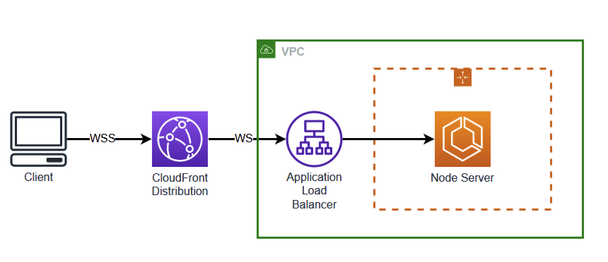

# CDK Websocket Server

In this demo, we see how to build a simple WebSocket server using Amazon Elastic Container Service with Fargate. This demo also includes an [Amazon CloudFront Distribution](https://docs.aws.amazon.com/AmazonCloudFront/latest/DeveloperGuide/distribution-working-with.html), [Application Load Balancer](https://aws.amazon.com/elasticloadbalancing/application-load-balancer/), and [Auto Scaling group](https://docs.aws.amazon.com/autoscaling/ec2/userguide/auto-scaling-groups.html). This will allow the server to scale up as needed while using TLS to secure the communication.



## ECS Fargate

## Docker Build

```Dockerfile
FROM --platform=linux/arm64 node:20-alpine AS build
WORKDIR /usr/src/app
COPY package*.json ./
RUN npm ci
COPY . .
RUN npm run build

FROM --platform=linux/arm64 node:20-alpine
ENV NODE_ENV=production
RUN apk add --no-cache curl
USER node
WORKDIR /usr/src/app
COPY --chown=node:node package*.json ./
COPY --from=build --chown=node:node /usr/src/app/node_modules ./node_modules
COPY --from=build --chown=node:node /usr/src/app/dist ./dist
EXPOSE 8080
CMD [ "node", "dist/server.js" ]
```

The Docker build is a simple Typescript based server that runs on NodeJS. This Dockerfile will copy the contents of the source directory and use `tsc` to transpile the Typescript file into Javascript before running.

### Cluster and Auto Scaling

First we will create the cluster that our container will run in.

```typescript
this.cluster = new Cluster(this, 'Cluster', {
  vpc: props.vpc,
  clusterName: 'websocket-service',
  containerInsightsV2: ContainerInsights.ENHANCED,
});
```

Because we are using Fargate (Serverless Containers) instead of EC2 for our compute infrastructure, we don't need an EC2 Auto Scaling Group. Our cluster automatically Provisions underlying instances based strictly on the Task Definitions we define for it.

### Fargate Task Definition

Next, we will create a Fargate container that will run our WebSocket Server. This will consist of several configurations that need to work together.

```typescript
const webSocketTask = new FargateTaskDefinition(
  this,
  'WebSocketTaskDefinition',
  {
    memoryLimitMiB: 2048,
    cpu: 1024,
    runtimePlatform: {
      operatingSystemFamily: OperatingSystemFamily.LINUX,
      cpuArchitecture: CpuArchitecture.ARM64,
    },
    taskRole: websocketServiceRole,
  },
);
```

Here we are setting up the basics of our compute. This Task will use `ARM64` compute. All components must be configured to use the same type of compute.

### Fargate Container

Next we will set up our container.

```typescript
webSocketTask.addContainer('WebSocketContainer', {
  image: ContainerImage.fromAsset('src/resources/containerImage'),
  containerName: 'websocket-service',
  portMappings: [{ containerPort: 8080, hostPort: 8080 }],
  logging: LogDrivers.awsLogs({
    streamPrefix: 'websocket-service',
  }),
  healthCheck: {
    command: ['CMD-SHELL', 'curl -f http://localhost:8080/health'],
    interval: Duration.seconds(30),
    timeout: Duration.seconds(30),
  },
  environment: {},
});
```

There are several key components here.

#### Port Mappings

In this example, we are using port `8080` on the container and host. Later we will see how to map the public facing port to this port.

#### Health Check

This container is also configured to perform periodic health checks to verify the container is running correctly. In this example, we are running a `curl` on the server.

### Fargate Service

Finally, we will create the Service using the previously created Task.

```typescript
const websocketService = new FargateService(this, 'WebSocketService', {
  cluster: this.cluster,
  taskDefinition: webSocketTask,
  assignPublicIp: true,
  desiredCount: 1,
  vpcSubnets: { subnetType: SubnetType.PUBLIC },
  enableExecuteCommand: true,
});

const scalableTarget = websocketService.autoScaleTaskCount({
  minCapacity: 1,
  maxCapacity: 5,
});

scalableTarget.scaleOnRequestCount('RequestScaling', {
  requestsPerTarget: 5,
  targetGroup: webSocketTargetGroup,
});
```

With the Fargate service running, we can tie this to an Application Load Balancer and enable automatic Task scaling. The Application Load Balancer tracks "Requests" using active connections—meaning when we hit 5 active WebSocket connections (artificially set low for testing this demo), the Application Auto Scaler will natively spin up a new Fargate container to balance the load!

#### Security Group

To ensure that only the Application Load Balancer can make requests to the Fargate container, we will attach a Security Group rule allowing the Application Load Balancer access to it natively.

```typescript
websocketService.connections.allowFrom(
  props.applicationLoadBalancer,
  Port.tcp(8080),
  'allow traffic on port 8080 from the ALB security group',
);
```

## Application Load Balancer

```typescript
this.applicationLoadBalancer = new ApplicationLoadBalancer(
  this,
  'ApplicationLoadBalancer',
  {
    vpc: this.vpc,
    internetFacing: true,
  },
);
```

The Application Load Balancer is created and associated with the VPC.

### Target Group

```typescript
const webSocketTargetGroup = new ApplicationTargetGroup(
  this,
  'webSocketTargetGroup',
  {
    vpc: props.vpc,
    port: 8080,
    protocol: ApplicationProtocol.HTTP,
    targets: [websocketService],
    healthCheck: {
      path: '/',
      protocol: Protocol.HTTP,
      port: '8080',
    },
  },
);
```

First, we will create a Target Group. This is where traffic will be sent. Here we can see port `8080` as the port to send traffic to on the container. This corresponds to the port exposed on the Fargate container. This Target Group will forward requests to the Fargate Service. This Application Load Balancer also includes a health check. This health check is different from the previously created health check as the Application Load Balancer is initiating this check rather than the container itself.

### Listener

```typescript
const webSocketListener = props.applicationLoadBalancer.addListener(
  'webSocketListener',
  {
    port: 80,
    protocol: ApplicationProtocol.HTTP,
    open: true,
    defaultAction: ListenerAction.fixedResponse(403),
  },
);

webSocketListener.addAction('ForwardFromCloudFront', {
  conditions: [
    ListenerCondition.httpHeader(props.customHeader, [props.randomString]),
  ],
  action: ListenerAction.forward([webSocketTargetGroup]),
  priority: 1,
});
```

Next we will create a Listener. Here we can see the listener is listening on port `80`. This is where we made the conversion from port `80` to port `8080`. We are using Protocol `HTTP`. The server will upgrade this HTTP request to WebSocket when it is received.

### Actions

To [restrict access to the Application Load Balancer](https://docs.aws.amazon.com/AmazonCloudFront/latest/DeveloperGuide/restrict-access-to-load-balancer.html) we will be adding a unique header to the CloudFront Distribution and a corresponding condition on the Application Load Balancer.

We do that here by creating a default action that responds with a `403`. This means that the Application Load Balancer will reject any request unless it includes a specific Header and Value. In this case, the Application Load Balancer will forward the request to the `webSocketTargetGroup`. We will be adding this Header and Value on the Origin of the CloudFront Distribution in the next step.

Note that the Application Load Balancer is using `HTTP` and not `HTTPS`. We will be enforcing `HTTPS` at the Cloudfront Distribution layer. Be only allowing traffic to our Application Load Balancer from our CloudFront Distribution, we can enforce `HTTPS` be used from the Client. This allows us to create a secure connection without a owning a domain that can be used to generate the certificate.

## Cloudfront Distribution

Finally, we will create our CloudFront Distribution. This will be used to provide TLS to our Application Load Balancer.

```typescript
const defaultOrigin = new LoadBalancerV2Origin(props.applicationLoadBalancer, {
  httpPort: 80,
  protocolPolicy: OriginProtocolPolicy.HTTP_ONLY,
  originId: 'defaultOrigin',
  customHeaders: {
    [props.customHeader]: props.randomString,
  },
});

this.distribution = new Distribution(this, 'Distribution', {
  defaultBehavior: {
    origin: defaultOrigin,
    viewerProtocolPolicy: ViewerProtocolPolicy.HTTPS_ONLY,
    cachePolicy: CachePolicy.CACHING_DISABLED,
    allowedMethods: AllowedMethods.ALLOW_ALL,
    originRequestPolicy: OriginRequestPolicy.ALL_VIEWER,
  },
  defaultRootObject: 'index.html',
  priceClass: PriceClass.PRICE_CLASS_100,
  logBucket: distributionLoggingBucket,
  enableLogging: true,
  minimumProtocolVersion: SecurityPolicyProtocol.TLS_V1_2_2021,
});
```

Here we are creating a CloudFront Distribution that only accepts HTTPS. This will create a certificate that is used by the Distribution. This Distribution will send that traffic to our Application Load Balancer on port `80` while injecting the secure `X-From-CloudFront` header automatically.

## Results

We have now created an auto-scaling, load-balanced application that is secured with `HTTPS` using a CloudFront Distribution. This will allow you to build a secure WebSocket server that will automatically adapt to your traffic needs.

## Why WebSockets Are Different

If you are used to deploying traditional REST APIs or web applications (HTTP/HTTPS), WebSockets introduce a fundamentally different paradigm. Here are the key differences requiring architectural adjustments when dealing with AWS CloudFront, ALBs, and ECS:

1. **Persistent Connections:** Traditional HTTP requests are ephemeral—they open, download data, and close. WebSockets establish a **long-lived, continuous connection**. You cannot simply scale WebSocket containers based exclusively on CPU/Memory thresholds; connection counts and persistent memory overhead dictate scale.
2. **Graceful Shutdowns Are Mandatory:** If a standard REST API Fargate task is killed to scale down, minimal impact occurs. If a WebSocket server task is abruptly killed, *all active users instantly drop their persistent connection*. To mitigate this, our `server.ts` handles `SIGTERM` and `SIGINT` signals by intercepting the shutdown, notifying the load balancer, and cleanly terminating existing connections before the container exits. 
3. **Load Balancer Stickiness (ALB vs. NLB):** For WebSockets, ALB routes the standard `Upgrade: websocket` header seamlessly. The ALB must convert the TLS/HTTPS connection (coming from CloudFront) into persistent TCP traffic to the ECS Task.
4. **CloudFront Caching Disabled:** WebSockets are dynamic, real-time pipelines. They **must not be cached**. Our CDK specifies `cachePolicy: CachePolicy.CACHING_DISABLED` to ensure CloudFront treats the endpoint merely as a TLS-terminating pass-through proxy. CloudFront natively supports WebSockets globally as long as you specifically configure the Origin to forward headers properly (`OriginRequestPolicy.ALL_VIEWER`).
5. **No Built-in Health Checks in Websocket Libraries:** You cannot use `ws` to perform an HTTP health ping natively. So we attach `express` to the exact same Node.js `/health` server block that serves the WebSocket context, exclusively so that the AWS Target Group health checks see a `200 OK` network response.

## Deployment

To deploy this demo, simply run:

```bash
npm install
npm run deploy
```

## Testing

Once the deployment finishes, AWS CDK will output the `WebSocketServer.websocketUrl` to the terminal. You can connect and test the live WebSocket service using a tool like `wscat`:

```bash
npx wscat -c wss://<YOUR-CLOUDFRONT-DOMAIN>.cloudfront.net/wss
```

After connecting, send any JSON payload to test the message echo:

```json
{"test": true}
```

### Testing the Auto Scaler

This repository contains a simple TypeScript tool called `load-test.ts`. You can use this script to rapidly simulate high connection throughput to see how AWS dynamically provisions containers for your traffic! 

1. Launch the traffic simulator by appending your outputted `WebSocketServer.websocketUrl` as a parameter:
   ```bash
   npm run load-test wss://<YOUR-CLOUDFRONT-DOMAIN>.cloudfront.net/wss
   ```

Because Application Load Balancers track WebSocket "Active Connections" identically to standard HTTP Request counts, the AWS CloudWatch Target Tracking alarm (`TargetTracking-service/websocket-service/WebSocket...`) will detect the sustained load limit. Wait roughly 3 minutes, and you will see ECS automatically transition into an `ALARM` state and trigger the Auto Scaler to start provisioning and booting additional Fargate task instances! 

*Note: The AWS CDK natively provisions `requestsPerTarget` to `5` for testing this boilerplate. You should increase this limit based on the memory of the instances you use in Production environments.*

## Removal

This demo does include services that can accumulate costs, so be sure to remove when not needed. To delete:

```bash
npm run destroy
```

You may have to manually delete the Auto Scaling Group if it is not able to automatically delete.
